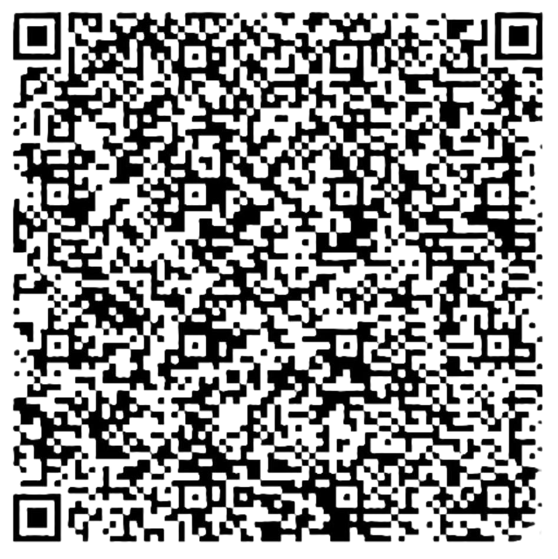

<!DOCTYPE html>
<html lang="en">
<head>
    <meta charset="UTF-8">
    <meta name="viewport" content="width=device-width, initial-scale=1.0">
    <title>Donasi atau Ucapan Terima Kasih</title>
    <link rel="stylesheet" href="style.css">
</head>
<body>
    

        <!-- Logo -->
        

        <!-- Judul -->
        <h1>Terima Kasih Telah Menggunakan Aplikasi Kami!</h1>
        
Jika Anda merasa aplikasi ini bermanfaat, silakan berdonasi sebagai bentuk dukungan.

        <!-- Gambar QRIS -->
        

            
            
SCAN di sini

        

        <!-- Formulir Input -->
        <form id="donationForm" class="form">
            <label for="name">Nama Anda:</label>
            <input type="text" id="name" name="name" placeholder="Masukkan nama Anda" required>

            <label for="amount">Nominal Donasi:</label>
            <input type="number" id="amount" name="amount" placeholder="Masukkan nominal" required>

            <button type="button" id="submitBtn">Klik Sawer</button>
        </form>

        <!-- Pesan Terima Kasih -->
        
Terima kasih atas donasi Anda!

    

    
</body>
</html>
